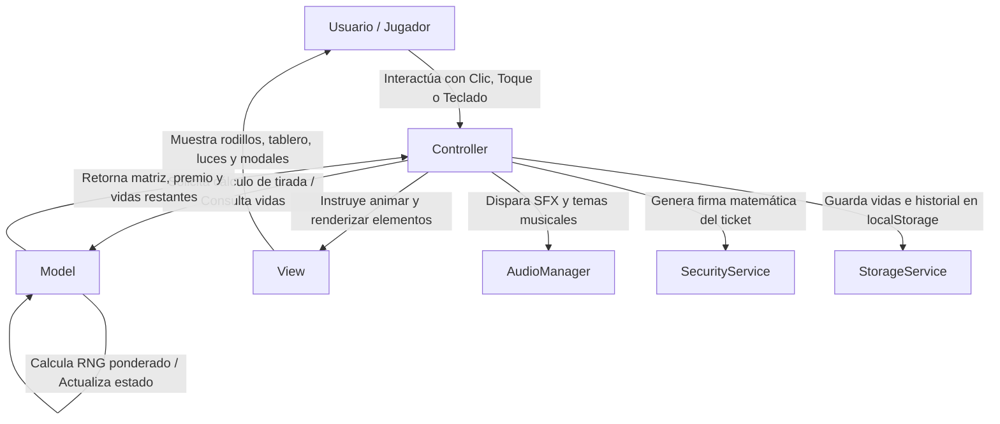

# 🍧 MANUAL OFICIAL DE FUNCIONAMIENTO — PLATAFORMA PARADICE
> **El Paraíso del Hielo & el Buen Ritmo**  
> Manual Técnico y Operativo Paso a Paso • Ecosistema Web, Catálogo de Juegos, Seguridad y Auditoría

---

## 📋 Tabla de Contenidos
1. [Visión General del Ecosistema Paradice](#1-visión-general-del-ecosistema-paradice)
2. [Arquitectura del Sistema (MVC + Core Services)](#2-arquitectura-del-sistema-mvc--core-services)
3. [Servicios Centrales Compartidos (Core Layer)](#3-servicios-centrales-compartidos-core-layer)
   - [3.1. AudioManager: Música Eurodance & SFX Web Audio](#31-audiomanager-música-eurodance--sfx-web-audio)
   - [3.2. SecurityService: Criptografía Dual-Hash & QR](#32-securityservice-criptografía-dual-hash--qr)
   - [3.3. StorageService: Persistencia de Vidas & Historial](#33-storageservice-persistencia-de-vidas--historial)
   - [3.4. TimerService: Temporizador de Tiro de 30 Segundos](#34-timerservice-temporizador-de-tiro-de-30-segundos)
4. [Landing Page Oficial (`index.html`) Paso a Paso](#4-landing-page-oficial-indexhtml-paso-a-paso)
   - [4.1. Navbar Fija & Controles de Música en Vivo](#41-navbar-fija--controles-de-música-en-vivo)
   - [4.2. Hero Section & Propuesta de Valor](#42-hero-section--propuesta-de-valor)
   - [4.3. Sedes Universitarias & Pedidos Geolocalizados](#43-sedes-universitarias--pedidos-geolocalizados)
   - [4.4. Portal Arcade: Catálogo de Juegos](#44-portal-arcade-catálogo-de-juegos)
   - [4.5. Modal Interactivo: Carta de 40 Sabores con Licor](#45-modal-interactivo-carta-de-40-sabores-con-licor)
5. [Juego 1: Tragamonedas Paradice (`tragamonedas.html`)](#5-juego-1-tragamonedas-paradice-tragamonedashtml)
   - [5.1. Matriz, Símbolos y Probabilidades RNG](#51-matriz-símbolos-y-probabilidades-rng)
   - [5.2. Tabla de Pagos y los 14 Niveles](#52-tabla-de-pagos-y-los-14-niveles)
   - [5.3. Flujo Operativo Paso a Paso](#53-flujo-operativo-paso-a-paso)
   - [5.4. Minijuego Hit Bar Integrado (Parada Columna a Columna)](#54-minijuego-hit-bar-integrado-parada-columna-a-columna)
   - [5.5. Panel de Auditoría y Supervisor Oculto](#55-panel-de-auditoría-y-supervisor-oculto)
6. [Juego 2: Minas Paradice (`minas.html`)](#6-juego-2-minas-paradice-minashtml)
   - [6.1. Tablero 5x5 y Dispersión de Minas](#61-tablero-5x5-y-dispersión-de-minas)
   - [6.2. Escalafón de Premios por Aciertos Seguros](#62-escalafón-de-premios-por-aciertos-seguros)
   - [6.3. Flujo Paso a Paso: Revelar vs Asegurar Premio](#63-flujo-paso-a-paso-revelar-vs-asegurar-premio)
7. [Juego 3: Hit Bar Rush 2.0 (`hitbar.html`)](#7-juego-3-hit-bar-rush-20-hitbarhtml)
   - [7.1. Dinámica Rítmica a 128-188 BPM y Velocidad Progresiva](#71-dinámica-rítmica-a-128-188-bpm-y-velocidad-progresiva)
   - [7.2. Los 6 Niveles y Blancos Láser](#72-los-6-niveles-y-blancos-láser)
   - [7.3. Flujo Paso a Paso: Frenado al Milisegundo](#73-flujo-paso-a-paso-frenado-al-milisegundo)
8. [Juego 4: Dice Battle Paradice (`dados.html`)](#8-juego-4-dice-battle-paradice-dadoshtml)
   - [8.1. Motor 3D de Dados y Combinaciones](#81-motor-3d-de-dados-y-combinaciones)
   - [8.2. Evaluación de Tríos, Escaleras, Pares y Sumas](#82-evaluación-de-tríos-escaleras-pares-y-sumas)
   - [8.3. Flujo Paso a Paso: Lanzamiento y Re-tiro Estratégico](#83-flujo-paso-a-paso-lanzamiento-y-re-tiro-estratégico)
9. [Juego 5: Ruleta Paradice Shot (`ruleta.html`)](#9-juego-5-ruleta-paradice-shot-ruletahtml)
   - [9.1. Canvas 2D en Alta Resolución y 12 Sectores](#91-canvas-2d-en-alta-resolución-y-12-sectores)
   - [9.2. Física de Inercia, Fricción y Aguja Superior](#92-física-de-inercia-fricción-y-aguja-superior)
   - [9.3. Flujo Paso a Paso: Giro y Detección de Casilla](#93-flujo-paso-a-paso-giro-y-detección-de-casilla)
10. [Juego 6: BattleRound Multijugador P2P (`battleround.html`)](#10-juego-6-battleround-multijugador-p2p-battleroundhtml)
    - [10.1. Arquitectura WebRTC P2P sin Base de Datos (PeerJS)](#101-arquitectura-webrtc-p2p-sin-base-de-datos-peerjs)
    - [10.2. Reglas: Destapar, Sembrar Minas y Robar Puntos](#102-reglas-destapar-sembrar-minas-y-robar-puntos)
    - [10.3. Flujo de Sala Paso a Paso (Host, Guest, QR y WhatsApp)](#103-flujo-de-sala-paso-a-paso-host-guest-qr-y-whatsapp)
    - [10.4. Fin de Ronda: El Perdedor Paga la Ronda](#104-fin-de-ronda-el-perdedor-paga-la-ronda)
11. [Centro de Verificación Anti-Fraude (`verificar.html`)](#11-centro-de-verificación-anti-fraude-verificarhtml)
    - [11.1. Procedimiento de Auditoría en Mostrador POS](#111-procedimiento-de-auditoría-en-mostrador-pos)
    - [11.2. Estados del Ticket: Válido, Ya Canjeado e Inválido](#112-estados-del-ticket-válido-ya-canjeado-e-inválido)
    - [11.3. Libro de Registro de Caja y Métricas](#113-libro-de-registro-de-caja-y-métricas)
12. [Guía de Despliegue y Mantenimiento](#12-guía-de-despliegue-y-mantenimiento)

---

## 1. Visión General del Ecosistema Paradice

**Paradice — El Paraíso del Hielo & el Buen Ritmo** es una plataforma web integral orientada al entretenimiento, fidelización comercial y ventas presenciales y virtuales de granizados artesanales con licor prémium (Whisky, Vodka, Tequila, Ginebra y Coñac) y bolsas de 6 litros para parches universitarios (Universidad Nacional, UD Tecnológica, UD Macarena) y eventos.

### Objetivos Principales de la Plataforma:
1. **Atracción y Gamificación:** Atraer a los clientes en puntos de venta mediante **6 minijuegos interactivos** inspirados en arcades y casinos retro de los años 90 y 2000.
2. **Incentivo al Consumo:** La gran mayoría de tiradas otorgan beneficios reales (descuentos desde -$500 hasta -$1.000 COP, toppings de gomitas, shots de licor gratis, promociones 2x1 y combos de 2 dobles por $23.000 COP).
3. **Control Anti-Fraude:** Emisión de cupones QR firmados criptográficamente para evitar falsificaciones en caja o modificaciones de enlaces en redes sociales.
4. **Experiencia Auditiva Inmersiva:** Reproductor de música continuo con **116 pistas legendarias de Eurodance, House y ritmos latinos clásicos**, acompañado de efectos sonoros generados dinámicamente con la Web Audio API.
5. **Cero Dependencias de Servidor:** Funciona al 100% como una aplicación estática (Single Page Application desacoplada) tanto en hostings como GitHub Pages, Netlify o Vercel, como en modo local sin conexión a internet (`file:///`).

---

## 2. Arquitectura del Sistema (MVC + Core Services)

La plataforma está diseñada bajo una arquitectura modular desacoplada en **Modelo-Vista-Controlador (MVC)** para cada minijuego, respaldada por una capa horizontal de **Servicios Core Centralizados**:

```
c:\Users\TC\Documents\Paradice\Juegos\
│
├── index.html                      # Landing Page Principal y Portal de Sabores
├── tragamonedas.html               # Juego 1: Tragamonedas Paradice (5x3)
├── slot.html                       # Alias idéntico a tragamonedas.html
├── minas.html                      # Juego 2: Minas Paradice (5x5)
├── hitbar.html                     # Juego 3: Hit Bar Rush 2.0 (Reflejo Rítmico)
├── dados.html                      # Juego 4: Dice Battle (Dados 3D)
├── ruleta.html                     # Juego 5: Ruleta Paradice Shot (12 Sectores)
├── battleround.html                # Juego 6: BattleRound (Multijugador P2P WebRTC)
├── verificar.html                  # Centro Oficial de Verificación de Caja
│
├── css\
│   └── style.css                   # Efectos neón, escarcha, glassmorphism y fuentes
├── images\
│   └── bg-granizados.jpg           # Texturas de fondo y elementos gráficos
├── music\                          # Catálogo de 116 pistas MP3 (Eurodance/Latinos)
│
└── js\
    ├── libs\
    │   └── qrcode.min.js           # Generador autónomo de códigos QR sin conexión
    ├── core\
    │   ├── AudioManager.js         # Reproductor universal, SFX y pistas de victoria
    │   ├── SecurityService.js      # Firma criptográfica dual-hash y tokens POS
    │   ├── StorageService.js       # Persistencia de vidas (3 vidas), historial y audio
    │   └── TimerService.js         # Temporizador de 30s para toma de decisiones
    └── mvc\
        ├── slot\                   # Arquitectura MVC de Tragamonedas
        │   ├── SlotConfig.js       # Símbolos, pesos RNG y tabla de pagos
        │   ├── SlotModel.js        # Lógica de rodillos, combinaciones y vidas
        │   ├── SlotView.js         # Render 5 columnas, animación blur y modales
        │   └── SlotController.js   # Orquestador de eventos, auto-spin y supervisor
        ├── minas\                  # Arquitectura MVC de Minas
        │   ├── MinasModel.js       # Tablero 5x5, dispersión de minas y niveles
        │   ├── MinasView.js        # Baldosas 3D, efectos de flip y popouts
        │   └── MinasController.js  # Destape de casillas, cash-out y vouchers
        ├── hitbar\                 # Arquitectura MVC de Hit Bar Rush 2.0
        │   ├── HitbarModel.js      # Niveles 1-6, objetivos y velocidades BPM
        │   ├── HitbarView.js       # Cinta de desplazamiento y láser central
        │   └── HitbarController.js # Frenado de precisión al milisegundo
        ├── dados\                  # Arquitectura MVC de Dice Battle
        │   ├── DadosModel.js       # Evaluación de tríos, escaleras, pares y sumas
        │   ├── DadosView.js        # Render de 3 dados 3D con puntos neón
        │   └── DadosController.js  # Lanzamiento, re-tiro y vouchers
        ├── ruleta\                 # Arquitectura MVC de Ruleta Paradice
        │   ├── RuletaModel.js      # 12 sectores, física angular y vidas
        │   ├── RuletaView.js       # Canvas 2D en alta resolución y aguja móvil
        │   └── RuletaController.js # Giro con inercia, desaceleración y premio
        └── verificar\              # Arquitectura MVC del Centro de Caja
            ├── VerificarModel.js   # Extracción de parámetros y validación hash
            ├── VerificarView.js    # Estados visuales (Válido / Usado / Alterado)
            └── VerificarController.js # Registro POS y auditoría de canjes
```

### Relación entre Componentes MVC:


---

## 3. Servicios Centrales Compartidos (Core Layer)

### 3.1. AudioManager: Música Eurodance & SFX Web Audio
Ubicación: `js/core/AudioManager.js`

Este servicio administra de manera unificada la experiencia sonora en todos los archivos de la plataforma:
1. **Catálogo de 116 Canciones:** Contiene una lista ordenada de archivos MP3 de éxitos de los años 90 y 2000 ubicados en la carpeta `music/` (*Haddaway, Dr. Alban, Corona, Technotronic, 2 Unlimited, Ace of Base, Whigfield, La Bouche, etc.*).
2. **Desbloqueo Inteligente de Autoplay:** Los navegadores modernos bloquean la reproducción automática hasta que el usuario interactúe. `AudioManager` escucha eventos pasivos (`click`, `touchstart`, `keydown`) en la primera interacción para desbloquear el `AudioContext` e iniciar la pista musical suavemente.
3. **Pistas Automáticas de Victoria (`WIN_TRACKS`):** Cuando un jugador obtiene un premio mayor (Jackpot, Super Promo 2x1 o Granizado Gratis), el sistema interrumpe temporalmente la lista estándar y reproduce una canción explosiva de celebración (*Sing Hallelujah, Everybody Dance Now, No Limit, Ven Bailalo, etc.*).
4. **Síntesis Procedural de SFX (Web Audio API):** Para garantizar que el juego funcione sin retrasos y sin requerir descargas pesadas adicionales, los efectos de sonido se generan mediante osciladores y nodos de ganancia en tiempo real:
   - `playSpinTick(index)`: Clics mecánicos rápidos con frecuencia modulada triangular (420 Hz a 650 Hz).
   - `playReelStop(reelIndex)`: Golpe seco y profundo en onda senoidal con caída exponencial.
   - `playIceClink(step)`: Sonido cristalino de hielo al destapar una casilla segura en Minas.
   - `playIceShatter()`: Explosión y fractura de hielo al golpear una mina o perder una vida.
   - `playDiceRoll()`: Ruido blanco y percusión simulando el rodar de los dados.
   - `playWheelTick()`: Chasquido del perno al golpear la aguja de la ruleta.
   - `playFailSound()`: Bocina cómica descendente cuando no hay premio (Mojarro / Blanqueo).

### 3.2. SecurityService: Criptografía Dual-Hash & QR
Ubicación: `js/core/SecurityService.js`

Garantiza la autenticidad e inviolabilidad de los cupones que los clientes presentan en caja o envían por WhatsApp:
1. **Generación de Terminal MAC:** Genera un identificador único por dispositivo (`MAC-XXXX-XXXX-XXXX`) almacenado en `localStorage`, simulando el terminal POS donde se realizó la jugada.
2. **Algoritmo de Hash Dual:** Combina dos algoritmos matemáticos en serie sobre una cadena que concatena datos sensibles y una clave secreta privada:
   $$\text{Raw} = \text{intento} \parallel \text{premio} \parallel \text{fecha} \parallel \text{hora} \parallel \text{terminal} \parallel \text{CLAVE\_SECRETA}$$
   - **Hash 1 (Bit-Shift Rolling Hash):** Genera una firma hex de 8 caracteres.
   - **Hash 2 (DJB2 Modificado con multiplicador 5381):** Genera una segunda firma hex de 8 caracteres.
   - **Firma Resultante (`sig`):** Concatenación de 16 caracteres hexadecimales en mayúsculas (ejemplo: `A4F8B2019E73C51A`).
3. **Construcción de URL de Verificación:** Crea un enlace público con parámetros codificados hacia `verificar.html` (`?intento=X&premio=Y&fecha=Z...&sig=HASH`).
4. **Generador de Código QR:** Utilizando la librería `js/libs/qrcode.min.js`, convierte la URL en un código QR de alta legibilidad proyectado en la pantalla del usuario.

### 3.3. StorageService: Persistencia de Vidas & Historial
Ubicación: `js/core/StorageService.js`

Capa de abstracción segura sobre `localStorage` con prefijo `paradice_`:
1. **Regla de 3 Vidas por Juego:** Cada juego cuenta con un pool independiente de 3 vidas. Cada vez que el jugador falla una tirada o estalla una mina, se descuenta una vida. Si recarga la página, las vidas se mantienen para evitar trampas por reinicio del navegador.
2. **Reinicio Controlado:** Las vidas se restablecen a 3 únicamente cuando:
   - Se completan las 3 vidas (partida finalizada) y el jugador pulsa "Jugar Otra Partida".
   - El supervisor presiona el botón de reinicio en el panel de control.
3. **Preferencias de Audio:** Guarda el estado de silencio de la música (`musicMuted`), silencio de efectos (`sfxMuted`) y el volumen maestro.
4. **Historial de Jugadas:** Almacena los últimos 10 tickets o partidas para auditoría local.

### 3.4. TimerService: Temporizador de Tiro de 30 Segundos
Ubicación: `js/core/TimerService.js`

1. Regula el tiempo en juegos por turnos (especialmente la Tragamonedas cuando se está en el mostrador frente al juez o supervisor).
2. Otorga exactamente **30 segundos** por jugada con una barra de progreso decreciente animada.
3. Si el tiempo expira sin que el usuario active la tirada, se ejecuta una penalización automática: se descuenta 1 vida, suena la alerta de tiempo agotado y se ofrece continuar con las vidas restantes.

---

## 4. Landing Page Oficial (`index.html`) Paso a Paso

La página de inicio (`index.html`) actúa como vitrina de marca, carta interactiva de productos y portal de acceso directo a los juegos.

```
+-------------------------------------------------------------------------+
| [🍧 PARADICE]  Inicio | Carta Sabores | Facultades | Arcade   [🎵] [🎰] |
+-------------------------------------------------------------------------+
|                               HERO                                      |
|            EL PARAÍSO DEL HIELO & EL BUEN RITMO                         |
|      Granizados Artesanales con Licor & Bolsa de 6 Litros               |
|      [🍹 Ver Carta de Sabores]      [🎰 Entrar al Arcade]               |
+-------------------------------------------------------------------------+
|                   SEDES UNIVERSITARIAS DESTACADAS                       |
|   [🏛️ UNAL Calle 26]      [⚙️ UD Tecnológica]     [🎨 UD Macarena]     |
+-------------------------------------------------------------------------+
|                         ZONA ARCADE (6 JUEGOS)                          |
|   [🎰 Tragamonedas]  [🧊 Minas]    [⚡ Hit Bar Rush]                     |
|   [🎲 Dice Battle]   [🎡 Ruleta]   [💥 BattleRound P2P]                 |
+-------------------------------------------------------------------------+
|                      PEDIDOS BOLSA DE 6 LITROS                          |
|             [💬 Pedir al WhatsApp]   [📋 Ver Sabores]                   |
+-------------------------------------------------------------------------+
| FOOTER & CONTROLES • 💬 Botón Flotante de WhatsApp                      |
+-------------------------------------------------------------------------+
```

### 4.1. Navbar Fija & Controles de Música en Vivo
1. **Fijación Glassmorphism:** Se mantiene anclada en la parte superior con desenfoque de fondo (`backdrop-blur-md`) y borde neón cian.
2. **Navegación Rápida:** Enlaces con scroll suave hacia `#hero`, `#facultades`, `#arcade` y `#contacto`.
3. **Controles Musicales:**
   - Botón `[🎵]`: Alterna entre Reproducir y Pausar la música de fondo.
   - Botón `[⏭️]`: Salta inmediatamente a la siguiente de las 116 pistas Eurodance.
   - Display `[🎶 Nombre de Pista]`: Muestra el título limpio del tema sonando en tiempo real (ej. *Haddaway - What Is Love*).
4. **Botón de Acción Directa:** Botón destacado `[🎰 Jugar Tragamonedas]` que lleva al juego principal.

### 4.2. Hero Section & Propuesta de Valor
- Titular de alto impacto visual con degradado cian-rosa-dorado y resplandor neón.
- Destaca los dos productos estrella de la marca:
  1. **Granizados artesanales individuales cargados con licor prémium** (Whisky, Vodka, Tequila, Ginebra y Coñac).
  2. **Bolsas de 6 Litros**, pensadas para previas universitarias, remates y fiestas.
- Métricas rápidas: 40+ Cócteles, Bolsa 6 Litros, Cobertura en Sedes y Arcade Interactivo en vivo.

### 4.3. Sedes Universitarias & Pedidos Geolocalizados
Presenta las tres sedes estratégicas donde opera Paradice en Bogotá, cada una con un botón directo a WhatsApp con mensaje precargado:
1. **Universidad Nacional (UNAL):** Porterías de la Calle 26, Calle 45 y Carrera 30.
2. **Universidad Distrital — Sede Tecnológica (UD Tecnológica):** Punto focal para estudiantes de ingeniería y tecnología.
3. **Universidad Distrital — Sede La Macarena (UD Macarena A y B):** Zona centro y cerros orientales.

### 4.4. Portal Arcade: Catálogo de Juegos
Muestra las tarjetas interactivas de los 6 juegos oficiales disponibles, indicando su mecánica y enlace directo de lanzamiento:
- **Tragamonedas Paradice:** 5 rodillos, 3 vidas, torre piramidal y Hit Bar integrado.
- **Minas Paradice:** Tablero 5x5, descarte de hielos rotos y botón de asegurar premio.
- **Hit Bar Rush 2.0:** Cinta rápida a 128-188 BPM y reflejo milimétrico en zona láser.
- **Dice Battle Paradice:** Duelos con 3 dados 3D translúcidos, tríos y escalerillas.
- **Ruleta Paradice Shot:** Ruleta neón de 12 sectores con desaceleración inercial física.
- **BattleRound Paradice:** Multijugador en vivo P2P vía WebRTC entre celulares.

### 4.5. Modal Interactivo: Carta de 40 Sabores con Licor
Al hacer clic en "Ver Carta de Sabores", se despliega un popout responsive con búsqueda y filtros:
1. **Buscador en Vivo:** Permite tipear cualquier ingrediente o nombre (ej. "sandia", "chicle", "smirnoff") y filtra al instante.
2. **Filtro por Tipo de Licor:** Botones para aislar sabores por base alcohólica:
   - **Whisky (7 cócteles):** *Éxtasis, Bombombún, Trópico, Citrus, Nerds, Pink Drink, Cherry Sling*.
   - **Vodka / Smirnoff (13 cócteles):** *Sandía, Smirnoff Manzana, Smirnoff Morazul, Smirnoff Limón, Candy, Caipiroska, Red Fantasy, Bubalú, Four Loko, Black Grape, Party Blue, Malibú, Sex on the Beach*.
   - **Ginebra (6 cócteles):** *Ibiza, Starblue, Paradise, Pasión Purple, Sweet Candy, Seducción*.
   - **Tequila (12 cócteles):** *Mango Biche, Ojo del Diablo, Clímax, Nebulosa, Blueberry Bloom, Tequilulo, Maracuyá Tequila, Maracumango, Maracululo, Panda Iki, Kriptonita, Maracutussi*.
   - **Coñac (2 cócteles):** *Tussi, Black Diamond*.
3. **Botón de Pedido por Sabor:** Cada tarjeta de sabor incluye un enlace que abre WhatsApp redactando el pedido exacto con el nombre del cóctel y sus ingredientes.

---

## 5. Juego 1: Tragamonedas Paradice (`tragamonedas.html`)

La máquina tragamonedas es el juego insignia del arcade, modelando una cuadrícula de 5 columnas por 3 filas (15 casillas visibles) con parada progresiva de rodillos y torre de pagos piramidal.

### 5.1. Matriz, Símbolos y Probabilidades RNG
Ubicación: `js/mvc/slot/SlotConfig.js`

El algoritmo de selección calcula la tirada mediante pesos ponderados independientes por rodillo:

| ID Símbolo | Nombre | Íconos | Categoría | Peso RNG | Probabilidad Relativa |
| :--- | :--- | :---: | :--- | :---: | :---: |
| `SYM_LIMON` | Limón | 🍋🍃 | Fruta Base | 28 | 20.4% |
| `SYM_NARANJA` | Naranja | 🍊✨ | Fruta Base | 26 | 19.0% |
| `SYM_COPA_AZUL` | Granizado Azul | 🍧🍒 | Bebida Estándar | 20 | 14.6% |
| `SYM_COPA_VERDE` | Granizado Menta | 🍹🍈 | Bebida Estándar | 18 | 13.1% |
| `SYM_SHOT` | Shot de Licor | 🥃🧊 | Alcohol | 14 | 10.2% |
| `SYM_COCTEL_ROJO` | Frozen Berries | 🍸🍓 | Especial | 10 | 7.3% |
| `SYM_VODKA` | Vodka Frozen | 🍷🍇 | Prémium | 8 | 5.8% |
| `SYM_CORAZON` | Vida Extra | 💖❤️ | Bonus Especial | 7 | 5.1% |
| `SYM_BONUS` | Bonus Coctelera | 🫗💉 | Bonus Especial | 5 | 3.6% |
| `SYM_GRATIS` | Granizado Gratis | ⭐🍧 | Jackpot | 2 | 1.4% (Muy Raro) |

### 5.2. Tabla de Pagos y los 14 Niveles
Al detenerse el último rodillo, el evaluador cuenta las coincidencias en toda la cuadrícula de 15 símbolos:

| Nivel | Código | Condición de Acierto | Beneficio / Premio | Feedback Visual y Sonoro |
| :---: | :---: | :--- | :--- | :--- |
| **13** | `JACKPOT` | 5+ Sellos ⭐ Granizado Gratis | **¡Granizado 100% Gratis!** | Confeti dorado masivo + Canción de victoria |
| **12** | `NIVEL_12` | 5 Cócteles Especiales (Berries / Vodka) | **2 Granizados Dobles x $23.000** | Confeti + Fanfarria mayor |
| **11** | `NIVEL_11` | 4 Cócteles Especiales (Berries / Vodka) | **Granizado Doble x $13.000** | Escala piramidal + Sonido victoria |
| **10** | `NIVEL_10` | 5 Granizados (Azul / Verde) | **-$1.000 COP de Descuento** | Resaltado dorado + Campanas |
| **9** | `NIVEL_9` | 5 Frutas (Limón / Naranja) | **-$900 COP de Descuento** | Resaltado naranja + Campanas |
| **8** | `NIVEL_8` | 4 Granizados Estándar | **-$600 COP de Descuento** | Escalón iluminado + Tintineo |
| **Bonus** | `BONUS_ALCOHOL` | 3+ Cocteleras 🫗 | **Jeringa de Alcohol Gratis** | Pulso neón fucsia + Alerta especial |
| **7** | `NIVEL_7` | 4 Frutas (Limón / Naranja) | **-$800 COP de Descuento** | Escalón rojo + Sonido descuento |
| **+1 Vida** | `BONUS_VIDA` | 3+ Corazones 💖 | **+1 Vida Extra (Recuperación)** | Destello rosado + Sonido de vida |
| **5** | `NIVEL_5` | 3 Granizados Estándar | **-$600 COP de Descuento** | Resaltado amarillo |
| **2x3** | `BONUS_2X3` | 3 Shots de Licor 🥃 | **Pague 2 Lleve 3** | Promo especial en caja |
| **4** | `NIVEL_4` | 3 Limones 🍋 | **-$500 COP de Descuento** | Resaltado amarillo cítrico |
| **3** | `NIVEL_3` | 3 Naranjas 🍊 | **-$400 COP de Descuento** | Resaltado naranja |
| **2** | `NIVEL_2` | Pareja de especiales (2 cócteles) | **-$300 COP de Descuento** | Resaltado leve |
| **1** | `NIVEL_1` | Pareja básica (2 frutas) | **-$150 COP de Descuento** | Resaltado base |
| **0** | `MOJARRO` | Menos de 2 iguales o sin combo | **Sin premio ("Mojarro")** | Bocina cómica de fallo + Descuento de vida |

### 5.3. Flujo Operativo Paso a Paso
1. **Inicio de Partida:** El sistema comprueba si el usuario tiene vidas en `StorageService`. Se muestran 3 vidas activas (❤️❤️❤️). El botón `[GIRAR]` se ilumina con respiración neón.
2. **Disparo de la Tirada:** El jugador presiona el botón circular `GIRAR` o pulsa la **Barra Espaciadora**.
   - Se descuenta 1 vida.
   - El botón se desactiva inmediatamente para evitar dobles peticiones.
   - Inicia el sonido de giro continuo (`playSpinTick`).
   - Los 5 rodillos entran en animación de scroll vertical con efecto de desenfoque de movimiento (*motion blur*).
3. **Parada Secuencial:** Los rodillos se frenan de izquierda a derecha con intervalos de tiempo programados:
   - Rodillo 1: 500 ms (Impacto seco con `playReelStop(0)`).
   - Rodillo 2: 950 ms (Impacto con `playReelStop(1)`).
   - Rodillo 3: 1.400 ms (Impacto con `playReelStop(2)`).
   - Rodillo 4: 1.850 ms (Impacto con `playReelStop(3)`).
   - Rodillo 5: 2.300 ms (Impacto final con `playReelStop(4)`).
4. **Escrutinio y Escalada Piramidal:** La vista analiza los 15 símbolos. Si hay coincidencia, la **Torre de Pagos** superior se ilumina escalón por escalón desde el nivel 0 hasta el nivel obtenido, produciendo un sonido ascendente. Los símbolos premiados parpadean en los rodillos.
5. **Resolución del Resultado:**
   - **Si ganó premio:** Salta confeti festivo, suena la pista de victoria y se despliega el **Modal de Premio** con dos opciones:
     - `[RECLAMAR PREMIO]`: Consume las vidas restantes y genera el **Voucher con Código QR Firmado** para canjear en caja o enviar a WhatsApp.
     - `[DESCARTAR Y VOLVER A TIRAR]`: Cierra el modal y permite gastar las vidas restantes para buscar un premio mayor.
   - **Si resultó en Mojarro:** Suena la bocina cómica de fallo. Se despliega un modal breve anunciando la pérdida de vida. Si quedan vidas (❤️❤️ o ❤️), se activa el temporizador de 30 segundos para la siguiente tirada. Si las vidas llegan a 0, la terminal se bloquea indicando "Fin de Partida".

### 5.4. Minijuego Hit Bar Integrado (Parada Columna a Columna)
Con una probabilidad del **~28%** en cualquiera de las 3 vidas, el sistema activa el evento especial interactivo **Hit Bar Rush dentro de la Tragamonedas**:
1. El banner superior cambia a modo neón ámbar: *"¡MODO HIT BAR ACTIVADO! Frena columna por columna en la línea central"*.
2. El botón principal se transforma en **`[FRENAR COLUMNA 1/5]`**.
3. Los rodillos giran a súper velocidad. El jugador debe pulsar el botón (o la barra espaciadora) para detener manualmente la columna 1, luego la 2, la 3, la 4 y la 5.
4. Con cada acierto en la línea media central, los rodillos restantes aceleran su giro aumentando la adrenalina rítmica.
5. Al frenar la quinta columna, se evalúa el combo alcanzado garantizando premios altos o promociones 2x1.

### 5.5. Panel de Auditoría y Supervisor Oculto
Pensado para demostraciones comerciales frente a dueños de puntos de venta y pruebas de integración:
- Existe un botón accesible desde la interfaz que abre el modal de **Opciones de Supervisor**.
- Permite forzar resultados instantáneos: `[Forzar Jackpot ⭐]`, `[Forzar Bonus Coctelera]`, `[Forzar Vida Extra]`, `[Forzar Evento Hitbar]` o `[Forzar Mojarro]`.
- Facilita verificar que todos los flujos visuales, audios, códigos QR y registros en `verificar.html` respondan a la perfección.

---

## 6. Juego 2: Minas Paradice (`minas.html`)

Juego de tensión estratégica, intuición y retiro a tiempo inspirado en el clásico Buscaminas y juegos de crash modernos.

```
+-------------------------------------------------------+
|  MINAS PARADICE • 3 VIDAS       Vidas: ❤️❤️❤️         |
|  Premios Acumulados: -$1.000 COP                      |
+-------------------------------------------------------+
|   [🧊]  [🧊]  [🍧]  [🧊]  [🧊]                        |
|   [🧊]  [🍹]  [🧊]  [🧊]  [🧊]     Tablero 5x5        |
|   [🧊]  [🧊]  [🧊]  [💥]  [🧊]     25 Casillas Hielo  |
|   [🍸]  [🧊]  [🧊]  [🧊]  [🧊]     3 Minas Ocultas    |
|   [🧊]  [🧊]  [🧊]  [🧊]  [🧊]                        |
+-------------------------------------------------------+
|  [💰 ASEGURAR PREMIO ($1.000)]     [🔄 NUEVA RONDA]   |
+-------------------------------------------------------+
```

### 6.1. Tablero 5x5 y Dispersión de Minas
Ubicación: `js/mvc/minas/MinasModel.js`

1. El tablero consta de **25 bloques de hielo 3D**.
2. Al iniciar cada ronda, se eligen de forma pseudoaleatoria **3 posiciones secretas para las minas** mediante un conjunto `Set` único:
   ```javascript
   while (this.mines.size < this.minesCount) {
     const randIndex = Math.floor(Math.random() * 25);
     this.mines.add(randIndex);
   }
   ```
3. Las **22 casillas restantes son Hielos Seguros**, cada una conteniendo un ícono de cóctel o fruta refrescante (`🍧`, `🍹`, `🍸`, `🥃`, `🍷`, `🍓`, `🍇`, `🍍`, `🧊`).

### 6.2. Escalafón de Premios por Aciertos Seguros
Entre más bloques de hielo destape el jugador sin tocar una mina, mayor es la recompensa:

| Hielos Destapados | Beneficio Acumulado | Nivel de Riesgo |
| :---: | :--- | :--- |
| **1 Acierto** | -$500 COP de Descuento | Muy Bajo (88% probabilidad) |
| **2 Aciertos** | -$1.000 COP de Descuento | Bajo (76% probabilidad) |
| **3 Aciertos** | Topping de Gomitas Gratis | Moderado (65% probabilidad) |
| **4 Aciertos** | Shot de Licor Extra Gratis | Alto (55% probabilidad) |
| **5 Aciertos** | 50% OFF en el 2do Granizado | Muy Alto (46% probabilidad) |
| **6 Aciertos** | **¡SUPER PROMO 2x1 EN GRANIZADOS!** | Extremo (Jackpot) |
| **8 Aciertos** | Combo Amigos: 2 Dobles x $23.000 | Maestro del Hielo |

### 6.3. Flujo Paso a Paso: Revelar vs Asegurar Premio
1. **Iniciar Partida:** El usuario toca un bloque de hielo congelado. Se descuenta 1 vida.
2. **Revelación de Casilla:**
   - **Si es Hielo Seguro:** La baldosa rota en 3D (`transform: rotateY(180deg)`), se tiñe de verde esmeralda translúcido, suena el tintineo de cristal `playIceClink` y se incrementa el contador de aciertos.
   - El botón **`[ASEGURAR PREMIO ACTUAL]`** se activa iluminándose en color dorado brillante, indicando exactamente el premio alcanzado hasta ese momento.
3. **La Gran Decisión:**
   - **Opción A: Retirarse (Cash-Out):** El jugador pulsa `[ASEGURAR PREMIO]`. El juego se detiene, suena la fanfarria de victoria y se genera inmediatamente el **Voucher QR Criptográfico** y el enlace para redimir por WhatsApp o en caja.
   - **Opción B: Seguir Arriesgando:** El jugador toca otro bloque no revelado buscando escalar a un premio superior (ej. pasar de -$1.000 al 2x1).
4. **Detonación de Mina (Ice Shatter):**
   - Si el jugador toca una mina: la baldosa estalla en rojo neón con la animación de vibración (*shake*), suena la explosión de hielo triturado `playIceShatter` y se revelan automáticamente las otras 2 minas ocultas para demostrar total transparencia.
   - Se pierde todo lo acumulado en esa ronda y se descuenta una vida.
   - Si quedan vidas, el botón cambia a `[CONTINUAR CON SIGUIENTE VIDA]`. Si se agotan las 3 vidas, se muestra la pantalla de bloqueo de terminal.

---

## 7. Juego 3: Hit Bar Rush 2.0 (`hitbar.html`)

Minijuego rítmico de reflejos de alta precisión, diseñado para reproducir la emoción de las máquinas de habilidad arcade.

### 7.1. Dinámica Rítmica a 128-188 BPM y Velocidad Progresiva
Ubicación: `js/mvc/hitbar/HitbarModel.js`

Una cinta sinfín horizontal/vertical despliega una secuencia continua de frutas y cócteles que pasan a través de una **Zona Láser Central** iluminada con resplandor neón. La velocidad de la cinta está calibrada con el tempo musical (BPM) del Eurodance:

```
[ CINTA DESLIZANTE CON SÍMBOLOS ]
======[ 🍊 ]===[ 🍧 ]===[ 🍋 (BLANCO) ]===[ 🥃 ]===[ ⭐ ]======
                           |||
                 [ 🎯 ZONA LÁSER CENTRAL ]
                           |||
                   [ BOTÓN: ¡FRENAR! ]
```

### 7.2. Los 6 Niveles y Blancos Láser

| Nivel | Ícono Objetivo | Nombre del Blanco | BPM | Velocidad Cinta | Recompensa al Atinar |
| :---: | :---: | :--- | :---: | :---: | :--- |
| **1** | 🍋 | Limón Glacial | 130 | 6.8 px/f | -$500 COP de Descuento |
| **2** | 🍊 | Naranja Fresh | 140 | 9.8 px/f | -$1.000 COP de Descuento |
| **3** | 🍬 | Topping de Gomitas | 150 | 13.5 px/f | Topping de Gomitas Gratis |
| **4** | 🥃 | Shot de Licor Extra | 162 | 17.5 px/f | Shot de Licor Extra Gratis |
| **5** | 🍧 | Granizado Doble | 174 | 22.0 px/f | 50% OFF en el 2do Granizado |
| **6** | ⭐ | **Estrella Paradice (Jackpot)** | 188 | 27.5 px/f | **¡SUPER PROMO 2x1 EN GRANIZADOS!** |

### 7.3. Flujo Paso a Paso: Frenado al Milisegundo
1. **Asignación del Objetivo:** La pantalla muestra el ícono blanco a cazar (ejemplo: *"Nivel 2: Atínale a la Naranja Fresh"*).
2. **Inicio del Movimiento:** La cinta comienza a desplazarse a toda velocidad. Los sintetizadores de audio marcan el compás rítmico.
3. **Disparo / Frenado:** El jugador presiona el botón gigante **`¡FRENAR AHORA!`** o pulsa la Barra Espaciadora cuando cree que el objetivo está exactamente centrado en la zona láser.
4. **Cálculo de Tolerancia:** El controlador mide la distancia en píxeles entre el centro del símbolo objetivo y el centro del colimador láser:
   - **Impacto Perfecto (Tolerancia $\le \pm 22$ px):** ¡NIVEL SUPERADO! La pantalla destella en verde, suena el acorde triunfal y se despliegan dos opciones:
     - `[COBRAR PREMIO]`: Finaliza la partida y genera el voucher QR firmado.
     - `[SUBIR AL SIGUIENTE NIVEL]`: Acepta el reto, la cinta acelera un nivel más rápido y el objetivo cambia.
   - **Fallo (Fuera de tolerancia):** La cinta vibra en rojo, suena la alerta de error y se descuenta una vida. Si quedan vidas, se puede reintentar el nivel actual.
5. **Victoria Máxima:** Al superar el Nivel 6 con la Estrella ⭐, se detiene el juego con fanfarria mayor, explosión de confeti y entrega de la **Super Promo 2x1**.

---

## 8. Juego 4: Dice Battle Paradice (`dados.html`)

Duelo de 3 dados de hielo translúcido en física y renderizado 3D, ideal para jugar en grupo o en la barra del local.

```
       +-------+
      /   o   /|
     /       / |       [ DADO 1 ]   [ DADO 2 ]   [ DADO 3 ]
    +-------+  o          ( 5 )        ( 5 )        ( 5 )
    |   o   |  /     
    |       | /             ¡TRÍO GLACIAL DETECTADO!
    |   o   |/            ¡SUPER PROMO 2x1 EN GRANIZADOS!
    +-------+
```

### 8.1. Motor 3D de Dados y Combinaciones
Ubicación: `js/mvc/dados/DadosModel.js`

1. Utiliza estilos de perspectiva CSS 3D (`transform-style: preserve-3d`) para modelar 6 caras por dado con esquinas redondeadas, textura de escarcha y puntos luminosos de color neón cian y fucsia.
2. Al lanzar, cada dado realiza entre 4 y 6 giros aleatorios en los ejes X, Y y Z acompañados de audio de dados rebotando contra madera y hielo (`playDiceRoll`).

### 8.2. Evaluación de Tríos, Escaleras, Pares y Sumas
El evaluador matemático clasifica los 3 números arrojados:

| Categoría | Combinación Requerida | Premio Otorgado |
| :--- | :--- | :--- |
| **TRÍO (Jackpot)** | 3 dados idénticos (ej. 4-4-4, 6-6-6) | **¡SUPER PROMO 2x1 EN GRANIZADOS!** |
| **SUMA ALTA** | Suma total de los 3 dados entre 14 y 18 | **Combo Amigos: 2 Dobles x $23.000** |
| **ESCALERA** | Consecutivos (1-2-3, 2-3-4, 3-4-5 o 4-5-6) | **50% OFF en el 2do Granizado** |
| **PAR** | 2 dados idénticos (ej. 2-2-5, 3-6-3) | **Shot de Licor Extra Gratis** |
| **SUMA MEDIA** | Suma total entre 10 y 13 | **Topping de Gomitas Gratis** |
| **SUMA 7 A 9** | Suma total entre 7 y 9 | **-$1.000 COP de Descuento** |
| **SUMA BAJA** | Suma total entre 3 y 6 | **-$500 COP de Descuento** |

### 8.3. Flujo Paso a Paso: Lanzamiento y Re-tiro Estratégico
1. **Lanzar Dados:** El jugador presiona el botón `[LANZAR DADOS]`. Se consume 1 vida de las 3 disponibles.
2. **Animación de Agitado:** Los dados se elevan, rotan tridimensionalmente y caen revelando las 3 caras superiores con sonido de impacto.
3. **Visualización del Premio:** La tarjeta inferior resalta la categoría obtenida y el descuento correspondiente.
4. **Estrategia del Jugador:**
   - Si el resultado es favorable (ej. Trío o Escalera): El jugador pulsa **`[RECLAMAR CUPÓN QR]`** y asegura su premio.
   - Si obtuvo una suma baja o desea tentar la suerte: Puede pulsar **`[VOLVER A TIRAR]`**, consumiendo otra vida para intentar conseguir el 2x1.

---

## 9. Juego 5: Ruleta Paradice Shot (`ruleta.html`)

La clásica rueda de la fortuna de casino adaptada al universo frozen neón con física realista de inercia y fricción.

### 9.1. Canvas 2D en Alta Resolución y 12 Sectores
Ubicación: `js/mvc/ruleta/RuletaModel.js`

Se dibuja en un elemento `<canvas>` ajustado a la densidad de píxeles del dispositivo (`window.devicePixelRatio`) para máxima nitidez en pantallas Retina de smartphones:

| Sector | Título del Sector | Color Visual | Beneficio |
| :---: | :--- | :---: | :--- |
| **1** | ¡PROMO 2x1! ⭐ | Dorado Neón (`#facc15`) | Paga 1 y lleva 2 granizados |
| **2** | 50% OFF 2do | Azul Glacial (`#0284c7`) | 2do vaso a mitad de precio |
| **3** | -$1.000 COP | Verde Esmeralda (`#059669`) | Descuento directo en caja |
| **4** | Shot Extra | Fucsia Fiesta (`#db2777`) | Inyección de licor gratis |
| **5** | 2 Dobles x23k | Morado Uva (`#7c3aed`) | Combo para compartir |
| **6** | -$500 COP | Cian Eléctrico (`#06b6d4`) | Descuento directo en caja |
| **7** | Gomitas Gratis | Violeta (`#9333ea`) | Topping premium gratis |
| **8** | **Hielo Roto 💀** | **Rojo Peligro (`#e11d48`)** | **Sin Premio (Mojarro / Pierde Vida)** |
| **9** | 50% OFF 2do | Azul Glacial (`#0284c7`) | 2do vaso a mitad de precio |
| **10** | -$800 COP | Verde Menta (`#10b981`) | Descuento directo en caja |
| **11** | Shot Extra | Rosa Neón (`#ec4899`) | Inyección de licor gratis |
| **12** | Pague 2 Lleve 3 | Amarillo Ámbar (`#eab308`) | Promoción 2x3 para parches |

### 9.2. Física de Inercia, Fricción y Aguja Superior
1. **Impulso Angular:** Al accionar el giro, la ruleta recibe una velocidad angular inicial aleatoria de entre $18$ y $28$ radianes por segundo más un desfase fraccionario para garantizar que el resultado sea impredecible.
2. **Desaceleración Exponencial:** En cada cuadro de renderizado (`requestAnimationFrame`), la velocidad se multiplica por un factor de fricción de $0.985$.
3. **Colisión de Clavijas:** Cada vez que uno de los 12 pines perimetrales cruza la aguja indicadora situada en la cúspide ($270^\circ$ o $\frac{3\pi}{2}$ rad), la aguja se desvía elásticamente y se emite un clic sonoro `playWheelTick`.
4. **Detención:** Cuando la velocidad cae por debajo de $0.002$ rad/s, la física se detiene por completo y se calcula con exactitud matemática el sector apuntado.

### 9.3. Flujo Paso a Paso: Giro y Detección de Casilla
1. El jugador presiona **`[GIRAR RULETA]`**. Se consume 1 vida.
2. La rueda gira vertiginosamente mientras la aguja vibra al compás de los pines metálicos.
3. La ruleta pierde velocidad progresivamente hasta quedar quieta sobre una casilla.
4. **Evaluación:**
   - Si cae en **Hielo Roto 💀**: Suena la bocina cómica de fallo. Se descuenta la vida y el jugador debe reintentar o ceder el turno.
   - Si cae en cualquier sector premiado: Salta el modal triunfal con el beneficio obtenido, habilitando el botón para emitir el cupón de canje QR.

---

## 10. Juego 6: BattleRound Multijugador P2P (`battleround.html`)

Duelo multijugador en vivo de hasta 6 personas diseñado para usarse en mesas de amigos, previas universitarias o barras de eventos bajo la regla: **"El que menos puntos tenga, paga la ronda de granizados"**.

```
+-------------------------------------------------------------------------+
| [💥 BATTLEROUND]          SALA: #4821                      [ ☰ Menú ]   |
+-------------------------------------------------------------------------+
| TURNO: Carlos 🍹          Minas Disponibles: 💣 1                       |
| 👉 Toca una casilla oculta para destapar un granizado                   |
+-------------------------------------------------------------------------+
|                      TABLERO 6x6 (36 HIELOS)                            |
|       [🍧] [🧊] [🍹] [🧊] [🧊] [🧊]        MARCADOR EN VIVO             |
|       [🧊] [🥃] [🧊] [🧊] [💥] [🧊]        1. Carlos:   850 pts (👑)   |
|       [🧊] [🧊] [🧊] [🍧] [🧊] [🧊]        2. Sofi:     600 pts        |
|       [🍹] [🧊] [🧊] [🧊] [🧊] [🧊]        3. Juancho:  100 pts (💀)   |
|       [🧊] [🧊] [🥃] [🧊] [🧊] [🧊]                                     |
|       [🧊] [🧊] [🧊] [🧊] [🍧] [🧊]        REGISTRO EN VIVO:            |
|                                            💥 ¡Carlos emboscó a Juancho |
| 🍧 +100 | 🍹 +250 | 🥃 +500 | 💣 Minas    robándole 400 puntos!        |
+-------------------------------------------------------------------------+
```

### 10.1. Arquitectura WebRTC P2P sin Base de Datos (PeerJS)
Ubicación: `battleround.html` y `GUIA_MULTIJUGADOR_BATTLEROUND.md`

1. **Sin Backend Dedicado:** Corre al 100% en GitHub Pages utilizando la librería **PeerJS 1.5.4**.
2. **Topología en Estrella (Host-Centric P2P):**
   - El creador de la sala actúa como **Servidor/Anfitrión (Host)**.
   - Los amigos se conectan como **Clientes (Guests)** mediante canales de datos WebRTC cifrados.
3. **Servidores STUN / TURN:**
   - Integra los servidores STUN públicos de Google y Twilio para descubrimiento de NAT.
   - Emplea los servidores TURN oficiales de PeerJS para atravesar redes celulares 4G/5G y cortafuegos universitarios vía puerto 443 TCP.
4. **Wake Lock API & Reconexión:**
   - Activa `navigator.wakeLock.request('screen')` para impedir que el teléfono del anfitrión apague la pantalla.
   - Escucha `visibilitychange` para restablecer la conexión inmediatamente si el anfitrión va y vuelve de WhatsApp.

### 10.2. Reglas: Destapar, Sembrar Minas y Robar Puntos
El juego se disputa en un tablero de **6x6 (36 casillas de hielo)** por turnos sucesivos:
1. **Destape de Granizados:**
   - 🍧 **Granizado Estándar:** $+100$ Puntos.
   - 🍹 **Granizado Doble:** $+250$ Puntos.
   - 🥃 **Shot de Tequila:** $+500$ Puntos.
2. **Obtención y Siembra de Minas:** Cada vez que un jugador acierta un granizado, recibe **1 Mina Trampa 💣** en su inventario personal. En su turno, puede plantarla en secreto en cualquier casilla aún no destapada. **Solo ese jugador sabe dónde está sembrada su mina**.
3. **Emboscada y Robo de Puntos:** Si un rival, en su respectivo turno, toca la casilla donde habías plantado tu mina:
   - ¡BOOM! La casilla estalla con animación de sacudida y sonido de detonación.
   - El jugador que pisó la mina **pierde el 100% de sus puntos de la ronda**.
   - **Tú te robas automáticamente todos los puntos que el rival perdió**.

### 10.3. Flujo de Sala Paso a Paso (Host, Guest, QR y WhatsApp)
1. **Paso 1 (Crear la Sala):** El usuario ingresa su apodo (ej. "Carlos"), escoge su avatar (🍹, 🥃, 🍺, 👑) y pulsa **`CREAR SALA`**.
2. **Paso 2 (Invitar al Parche):** La pantalla genera un código único de 4 dígitos (ejemplo: `#4821`), un **código QR grande** y un botón **`WhatsApp`**.
   - Los amigos cercanos simplemente escanean el QR con su cámara.
   - Los amigos a distancia reciben el link directo: `https://.../battleround.html?room=4821`.
3. **Paso 3 (Lobby de Espera):** Conforme se unen los jugadores, aparecen en la lista con su avatar y estado "Listo". El host también tiene un botón `[Añadir Bot]` por si falta una persona para completar la mesa.
4. **Paso 4 (Comenzar el Duelo):** Cuando todos estén dentro, el anfitrión pulsa **`¡INICIAR DUELO DE HIELOS!`**. Todos los dispositivos pasan simultáneamente a la pantalla del tablero sincronizado.

### 10.4. Fin de Ronda: El Perdedor Paga la Ronda
Cuando se destapan las 36 casillas del tablero o se agota el tiempo:
1. Se despliega el **Podio Final de Batalla**.
2. Se corona al **1er Lugar (Campeón)** con confeti y aplausos.
3. Se proclama con alarma roja al **Perdedor de la Noche (último puesto)**:
   > *"💀 ¡A [Nombre del Perdedor] LE TOCA PAGAR LA RONDA DE GRANIZADOS EN PARADICE! 🍸"*
4. Aparece el botón **`[COBRAR LA RONDA POR WHATSAPP]`**, que redacta un mensaje automático al grupo de WhatsApp con el marcador oficial listo para cobrar la cuenta.

---

## 11. Centro de Verificación Anti-Fraude (`verificar.html`)

Módulo oficial de auditoría utilizado en caja, barras y terminales de supervisores para validar la autenticidad de los premios antes de entregar la bebida o aplicar el descuento.

```
+-------------------------------------------------------------------------+
| [🍧 PARADICE]  CENTRO OFICIAL DE AUDITORÍA & CONTROL POS                |
+-------------------------------------------------------------------------+
|                       ESTADO DEL TICKET ESCANEADO                       |
|                                                                         |
|      ======================================================             |
|      |  ✅ TICKET VÁLIDO Y AUTORIZADO                     |             |
|      |  Premio: ¡SUPER PROMO 2x1 EN GRANIZADOS!           |             |
|      |  Fecha: 07/09/2026 • Hora: 10:45 AM                |             |
|      |  Terminal: MAC-7A89-F412 • Intento: 2               |             |
|      |  Firma: 4D8F1A20BC39E801 (MATEMÁTICAMENTE VÁLIDA)  |             |
|      ======================================================             |
|                                                                         |
|                 [ ✅ MARCAR TICKET COMO CANJEADO ]                      |
+-------------------------------------------------------------------------+
| HISTORIAL DE CANJES DE HOY (TERMINAL CAJA-001)                          |
| 10:45 AM | Promo 2x1          | MAC-7A89-F412 | CANJEADO                |
| 10:20 AM | -$1.000 COP        | MAC-9912-A104 | CANJEADO                |
+-------------------------------------------------------------------------+
```

### 11.1. Procedimiento de Auditoría en Mostrador POS
1. El cliente presenta en su celular el código QR generado por cualquiera de los juegos.
2. El cajero o juez escanea el código con la cámara de su dispositivo o con un lector de códigos de barra 2D.
3. El navegador abre automáticamente `verificar.html` pasando los parámetros encriptados por la URL.
4. El controlador de verificación extrae los datos y ejecuta en segundo plano la función `SecurityService.validarTicket()`.

### 11.2. Estados del Ticket: Válido, Ya Canjeado e Inválido
La interfaz responde con tres posibles tarjetas de diagnóstico:

#### Caso 1: TICKET VÁLIDO (Tarjeta Verde Neón)
- **Causa:** La firma digital coincide exactamente con el cálculo matemático sobre la fecha, hora, premio y terminal.
- **Acción del Cajero:** Entrega la bebida o aplica el descuento en caja y pulsa el botón **`[MARCAR TICKET COMO CANJEADO]`**.
- **Resultado:** El ticket se guarda en la base local con estado `CANJEADO` junto con la marca de tiempo de la redención.

#### Caso 2: TICKET YA CANJEADO (Tarjeta Ámbar / Alerta)
- **Causa:** El cliente o un amigo intentó reutilizar el mismo código QR o recargar el enlace después de que ya se le entregó el beneficio.
- **Mensaje en Pantalla:** *"⚠️ ESTE TICKET YA FUE REDIMIDO EL DD/MM/AAAA A LAS HH:MM:SS EN ESTA TERMINAL"*.
- **Acción del Cajero:** Se rechaza la solicitud de entrega para evitar pérdidas comerciales.

#### Caso 3: TICKET INVÁLIDO O ALTERADO (Tarjeta Roja de Fraude)
- **Causa:** Un usuario malintencionado abrió el enlace en su navegador y modificó manualmente los parámetros de la URL (por ejemplo, cambió `premio=-$500` por `premio=Granizado+Gratis`).
- **Diagnóstico:** Al recalcular la función hash dual, la firma resultante no coincide con el parámetro `sig`.
- **Mensaje en Pantalla:** *"🚫 TICKET NO AUTORIZADO (FIRMA CRIPTOGRÁFICA INVÁLIDA). POSIBLE MANIPULACIÓN DETECTADA"*.
- **Acción del Cajero:** El sistema bloquea el canje y emite una alerta visual de fraude.

### 11.3. Libro de Registro de Caja y Métricas
En la sección inferior de `verificar.html`, el supervisor dispone de:
- **Identificador de Caja:** Asigna un ID único a cada punto de venta (`CAJA-XXXX`).
- **Buscador y Filtro:** Permite filtrar por fecha, tipo de premio o terminal MAC.
- **Totalizadores de Caja:** Muestra el número total de canjes ejecutados en el turno y la suma estimada de descuentos concedidos.
- **Exportación / Limpieza:** Opciones para reiniciar el libro de caja al cierre de jornada.

---

## 12. Guía de Despliegue y Mantenimiento

### 12.1. Despliegue en GitHub Pages (Recomendado)
Al tratarse de una arquitectura 100% estática basada en Vanilla JS, el despliegue es inmediato y gratuito:
1. Subir los archivos al repositorio:
   ```bash
   git add .
   git commit -m "Publicación completa de plataforma Paradice"
   git push origin main
   ```
2. En GitHub, ingresar a **Settings** > **Pages**.
3. En **Source**, seleccionar **Deploy from a branch**.
4. En **Branch**, seleccionar `main` y carpeta `/ (root)`.
5. Guardar. En pocos segundos el sitio estará activo en:  
   `https://[tu-usuario].github.io/[tu-repositorio]/index.html`

### 12.2. Ejecución Local sin Conexión
- **Doble Clic:** Cualquiera de los archivos (`index.html`, `tragamonedas.html`, `minas.html`, etc.) puede ejecutarse simplemente haciendo doble clic en el explorador de archivos de Windows (`file:///...`).
- **Servidor Local de Pruebas:**
  ```bash
  # Con Python 3:
  python -m http.server 8080

  # Con Node.js:
  npx serve .
  ```

### 12.3. Buenas Prácticas y Mantenimiento de Audio
- Si un usuario no escucha la música en su teléfono, debe recordar tocar cualquier parte de la pantalla una vez para que el navegador libere las políticas de Autoplay.
- Para cambiar la clave secreta de las firmas criptográficas en el futuro, basta con editar la constante `SECRET_KEY` en `js/core/SecurityService.js`. Todos los juegos actualizarán su firma al instante sin necesidad de recompilar nada.

---

**PARADICE © 2026** • *El Paraíso del Hielo & el Buen Ritmo*.  
Todos los derechos reservados. Insumos para Granizados & Coctelería Frozen • La Dosis.
